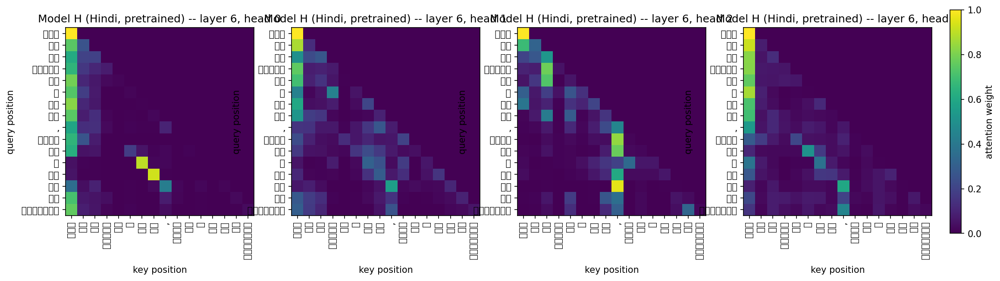
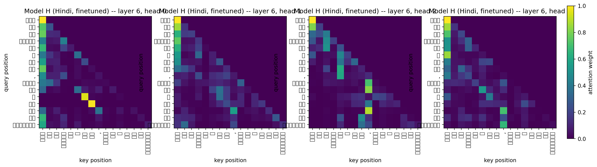
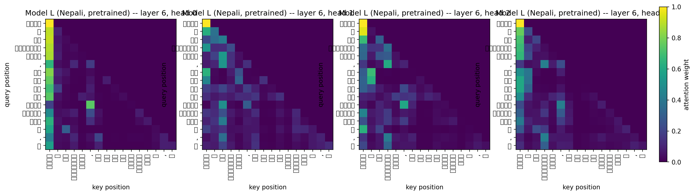
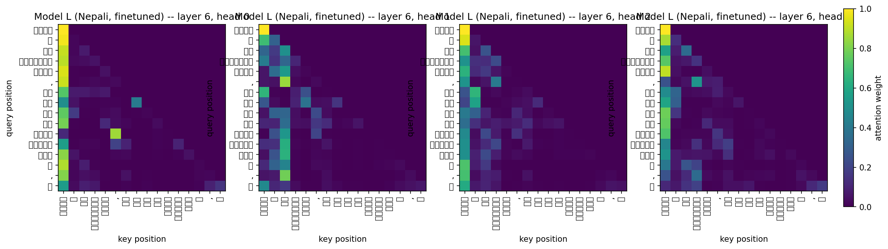

# Language Models and Agents — Final Project Report

**Two independent decoder-only Transformer language models, built, trained, and
analyzed entirely from scratch: Model H (Hindi, higher-resource) and Model L
(Nepali, lower-resource).** No shared data, tokenizer, vocabulary, or weights
between the two models at any stage.

This document consolidates Phase 1 (data + tokenizer), Phase 2 (architecture +
pretraining + evaluation), and Phase 3 (reasoning finetuning + attention
analysis + final comparison) into one report, in the order the project was
actually built, with the reasoning behind every major decision, the exact
algorithms/formulas used, every metric value obtained, and every figure
produced.

**Source reports this document consolidates** (kept as standalone, more
granular write-ups): `report/phase1/report.md`, `report/phase2/report.md`,
`report/phase3/report.md`.

---

## Abstract

Two ~25M-parameter decoder-only Transformer language models were implemented
from primitive PyTorch components (no `nn.Transformer*`, no HuggingFace model
classes, no pretrained weights or tokenizers anywhere), pretrained from
scratch on independently collected ~500M-token monolingual corpora (Hindi and
Nepali), evaluated on intrinsic (perplexity, bits-per-byte), generation
(BLEU-4, chrF++, ROUGE-L, diversity), and attention metrics, then finetuned on
a synthetic comparative-reasoning task in each model's own language. The
higher-resource model (Hindi) reached test perplexity 31.96 / bits-per-byte
0.526 and 36.75% reasoning exact-match accuracy after finetuning; the
lower-resource model (Nepali) reached perplexity 40.33 / bits-per-byte 0.481
(actually the more byte-efficient of the two) but only 8.75% reasoning
accuracy after finetuning — a gap shown, through a step-budget experiment,
qualitative error analysis, and an attention-reorganization comparison, to
reflect a genuine difference in how well each model's pretrained
representations transfer to a new structured task, not a fixable
hyperparameter or training-budget artifact.

---

## 1. Introduction

### 1.1 Project structure and hard constraints

| Model | Language tier | Language chosen |
|---|---|---|
| Model H | Higher-resource, any non-English Indian language | Hindi |
| Model L | Lower-resource, from a fixed allowed list | Nepali |

**Hard constraints** (drive nearly every architectural decision below): no
pretrained language models, no pretrained tokenizers, no HuggingFace
Transformer model classes — the architecture (positional embeddings,
multi-head attention, causal masking) must be implemented from primitive
`nn.Linear` / `nn.Embedding` / `nn.LayerNorm` / `nn.Dropout`. The two models
must never share data, tokenizer, vocabulary, or weights.

### 1.2 Why Hindi and Nepali

**Hindi (Model H)** was chosen as the higher-resource language because it has
the largest publicly available text volume of any non-English Indian
language by a wide margin — both in downloaded web-scale corpora and in a
dense, commercially mature online news ecosystem (sitemap-indexed archives
spanning years). This was deliberate: Model H is meant to be the *control* —
a case where the 500M-token target and 20% manual-collection floor are
achievable without heroics, so that any modeling problem surfaced later can
be attributed to architecture/training choices, not a starved corpus.

**Nepali (Model L)** was picked from the assignment's fixed allowed
lower-resource list (Assamese, Bhojpuri, Bodo, Dogri, Konkani, Maithili,
Manipuri, Mizo, Nepali, Sindhi) because it sits in a genuinely useful middle
ground: present in every major multilingual corpus used here, but only
thinly, with an active-but-fragmented news industry where several major
outlets explicitly block AI crawlers — scarce enough to be a real
stress-test of the manual-collection requirement, but not so scarce that
manual collection was a dead end.

### 1.3 Project pipeline overview

```
raw/ (per-source, never modified)  →  processed/corpus.jsonl (cleaned+deduped+sampled)  →  splits/{train,val,test}.jsonl
                                                                                                        │
                                                                          tokenizer training  ──────────┤
                                                                                                        │
                                                         Phase 2: pretraining (~500M tokens, ~25M params) ──→ Phase 2 evaluation (PPL/BPB, generation, attention)
                                                                                                        │
                                                         Phase 3: reasoning finetuning ──→ reasoning eval + attention comparison
```

Every stage follows the same `raw/ → processed/ → splits/` staging per
language, chosen so that (a) expensive scraping/downloading is never
repeated — `raw/` is append-only and every downstream stage rebuilds from it,
(b) `processed/` and `splits/` are fully reproducible build artifacts, safe to
regenerate, and (c) splitting happens at the **document level**, guaranteeing
no partial-document leakage between train/val/test.

---

## 2. Phase 1 — Data Collection and Tokenizer Construction

### 2.1 Downloaded sources (same four for both languages)

| Source | Why included |
|---|---|
| FineWeb2 | Large, deduplicated, quality-filtered multilingual web crawl — avoids raw Common Crawl's boilerplate/spam problems |
| IndicCorp | Purpose-built for Indic-language NLP — cleaner in-domain text than a generic crawl |
| Sangraha | Draws from different underlying sources than the other two — real diversity, not redundant coverage |
| Wikipedia (official dumps) | Encyclopedic register, balances the corpus against being purely news-flavored |

Using three overlapping-but-distinct web-scale corpora (not just one) was
deliberate: it reduces the risk of the downloaded portion being dominated by
one crawler's particular biases or gaps.

### 2.2 Manual collection methodology

**Compliance-first approach**: every candidate site's `robots.txt` was
checked *before* writing a scraper for one thing — does it disallow
`ClaudeBot` / `anthropic-ai` / `Claude-Web` by name, or carry the
`Content-Signal: ai-train=no` convention? If yes, excluded outright (never
routed around with a different user-agent).

**Per-site URL-discovery method varied by site infrastructure** rather than
forcing one uniform pattern:
- WordPress `wp-sitemap.xml` (most Nepali sources) — auto-generated,
  paginated, covers full post history.
- ID-range crawling (Setopati, Ratopati) — used where articles route by
  numeric ID regardless of slug text, confirmed empirically.
- Date-based sitemaps (Patrika, ABP Live) — daily sitemap files keyed by
  date, iterated backward through the archive.
- Custom two-level sitemap index (Ekantipur) — reverse-engineered since it
  matched no standard convention.
- Paginated date-archive crawling (OnlineKhabar) — a recovery re-scrape
  after an encoding bug had corrupted earlier non-ASCII text.

**Rate limiting**: 0.8s minimum interval per domain (not global — different
domains run in parallel), chosen as a middle ground between politeness and
throughput. To speed up collection, *more parallel domains* were added
rather than shortening this interval (strictly safer — no added risk to
already-running domains). Exception: Ratopati's `robots.txt` mandates
`Crawl-delay: 20`, honored as-is.

**Sites used — Hindi** (4 manual sources): Patrika, India TV, ABP Live,
Jagran (news, daily/flat sitemaps) + archive.org (42 books) + Hindi
Wikisource (4,267 documents).

**Excluded (Hindi)**: Amar Ujala, Dainik Bhaskar, BBC Hindi, News18 Hindi,
Zee News — explicit AI-crawler block.

**Sites used — Nepali** (10 manual sources, more than Hindi's 4 —
deliberately, since Nepali's per-site archives are shallower and major
outlets more often block AI crawlers, so reaching a comparable manual-token
count required spreading across more, smaller sources): DC Nepal, Ekantipur
(largest, ~65K articles), OnlineKhabar, Setopati, Khabarhub, Reporters
Nepal, Rajdhani Daily, Nepal Page, Bizmandu, Ratopati + archive.org (43
books).

**Excluded (Nepali)**: Baahrakhari, Himal Khabar, Samachar Patra, Karobar
Daily, SahityaPost, BBC Nepali, NepalPress — explicit AI-crawler block.

**Investigated but not viable** (compliant, but unusable for other reasons —
kept distinct from policy exclusions): Gorkhapatra (unreachable / wrong
content type), Nagarik News (broken sitemap — obtained via a third-party
GitHub corpus instead, correctly tagged `downloaded`), News24 Nepal
(suspended), Ekagajpatra (not actually a news site), Open Data Nepal
(structured data, not prose), Ujyaalo Online / Nepal Samaya (no discoverable
sitemap).

**Supplementary downloaded datasets (Nepali only)**: two Kaggle datasets
(20-category news corpus; a second Wikipedia snapshot) and two GitHub-hosted
corpora (Nagarik News recovery; a small sports-news set) — added to grow the
downloaded pool without duplicating FineWeb2/IndicCorp/Sangraha/Wikipedia
coverage. All tagged `downloaded`, not `manual`, per the project's actual
manual/downloaded distinction: **`manual` = we did the collection work
ourselves** (our scraper hit a live site, or we OCR'd/transcribed it);
**`downloaded` = someone else already collected and packaged it**,
regardless of the content's nature.

### 2.3 Cleaning pipeline

1. **Unicode normalization (NFC) + mojibake repair (`ftfy`)** — needed for
   inconsistent scraped/downloaded encodings; also ensures visually-identical
   characters hash identically during dedup.
2. **Script filtering** — keep only lines with ≥60% Devanagari characters
   (drops non-Devanagari boilerplate without discarding natural mixed-script
   sentences).
3. **Whitespace/punctuation normalization.**
4. **Exact-duplicate removal** via SHA-256 content hashing over
   normalized/lowercased/whitespace-collapsed text. **Manual/downloaded
   tie-break**: documents are sorted manual-first before deduping, so when
   the same content appears in both a manual scrape and a downloaded corpus,
   manual wins the collision (a deliberate, stable policy — not decided by
   arbitrary filename sort order).
5. **Minimum length filter** — drop documents under 20 characters
   post-cleaning.

### 2.4 Dataset statistics

| | Hindi (Model H) | Nepali (Model L) |
|---|---:|---:|
| Total documents | 1,368,253 | 1,893,004 |
| Total tokens (whitespace proxy) | 499,999,997 | 499,302,601 |
| Target tokens | 500,000,000 | 500,000,000 |
| Manual token fraction | 20.29% | 19.89% |
| Manual tokens | 101,450,874 | 99,302,601 |
| Downloaded tokens | 398,549,123 | 400,000,000 |
| Train / Val / Test doc counts | 1,340,887 / 13,682 / 13,684 | 1,855,143 / 18,930 / 18,931 |

Nepali's shortfall against the 500M target (697,399 tokens, 0.14%) is
negligible and a direct consequence of an intentional 400M downloaded-token
cap (Nepali's raw downloaded supply was never the constraint — manual
collection was) plus whatever manual collection had reached at build time,
not an inability to reach the target. Both corpora used `enforce_ratio=False`
sampling (prioritizing the 500M total-token target over strictly enforcing
the 20% manual floor); Hindi cleared 20% anyway (20.29%), Nepali landed just
under (19.89%), reported honestly rather than masked.

### 2.5 Tokenizer

**Algorithm**: SentencePiece BPE for both languages, chosen because BPE
balances vocabulary coverage and sequence-length efficiency for
morphologically rich Indic scripts, and SentencePiece doesn't require
whitespace pre-tokenization (important since Devanagari word boundaries and
whitespace don't always align as cleanly as in English).

**Vocabulary size**: 8,000 for both — deliberately smaller than an initially
planned 24K–32K, trading more aggressive subword splitting for a much smaller
embedding table (proportionally significant at a ~25M-parameter budget).
Both languages' unknown-token rates stayed well under 0.3% even at this
smaller size.

| | Hindi | Nepali |
|---|---:|---:|
| Vocabulary size | 8,000 | 8,000 |
| Avg chars/token (fertility) | 3.685 | 4.202 |
| Unknown-token rate | 0.261% | 0.190% |
| Vocab pieces used ≥1× (on val) | 7,868 / 8,000 (98.35%) | 7,899 / 8,000 (98.74%) |
| Used-piece frequency (min/median/mean/max) | 1 / 34 / 121.94 / 27,324 | 1 / 36 / 99.73 / 22,364 |
| Most frequent piece | `▁के` (2.85% of tokens) | `▁।` (2.84% of tokens) |

**This fertility difference (3.685 vs. 4.202 chars/token) is the single most
important tokenizer fact in this project** — it recurs as the explanation for
why Hindi and Nepali's Phase 2 perplexity and bits-per-byte numbers disagree
on which model is "better" (§3.6), and is cited again in Phase 3's final
comparison (§4.6).

---

## 3. Phase 2 — Architecture, Pretraining, and Evaluation

### 3.1 Architecture — design decisions

Implemented in `common/model/transformer.py`, shared *code*, fully
independent *weights* per language.

**Token + positional embeddings**: `(vocab_size × d_model)` lookup +
**learned absolute positional embeddings** (not sinusoidal/RoPE) — a
deliberate trade-off: at ~25M parameters with a fixed, known max sequence
length (512), a learned table is simpler to implement/verify/reason about,
costs only ~1% of total parameters (`512 × 512 ≈ 262K`), at the cost of
hard-capping the model at `max_seq_len` with no length extrapolation — judged
acceptable since neither model needs sequences beyond 512 tokens anywhere in
this project.

**Multi-head causal self-attention**, from first principles
(`CausalSelfAttention`), with four *independent* `nn.Linear` projections
($W_Q, W_K, W_V, W_O$) rather than one fused QKV matrix, prioritizing
readability over a minor efficiency gain:

$$\text{Attention}(Q,K,V) = \text{softmax}\!\left(\frac{QK^\top}{\sqrt{d_k}} + M\right)V$$

- Reshape `(B, T, D) → (B, T, h, d_k) → (B, h, T, d_k)`, $h=8$ heads,
  $d_k = d_{\text{model}}/h = 512/8 = 64$ (the same per-head dimension GPT-2
  uses).
- The $1/\sqrt{d_k}$ scale keeps pre-softmax logit variance roughly constant
  regardless of head size — without it, logit variance grows linearly with
  $d_k$ and pushes softmax toward a near-one-hot regime with vanishing
  gradients.
- $M$ is an additive causal mask ($0$ on allowed positions, $-\infty$ on
  future positions), registered as a buffer, sliced to the actual sequence
  length each forward pass.
- **Empirically verified** (not just assumed correct by construction):
  `common/model/sanity_checks.py` perturbs only the last token of a random
  sequence and checks every earlier position's logits are unchanged. Result,
  5 trials: `max_logit_diff_per_trial: [0.0, 0.0, 0.0, 0.0, 0.0]` — future
  tokens have *exactly zero*, not merely negligible, effect on earlier
  logits.

**Transformer block**: pre-norm self-attention (residual) → pre-norm
feed-forward (residual). **Pre-norm chosen over post-norm** because it keeps
the residual stream unnormalized end-to-end, empirically far more stable for
training-stability/learning-rate sensitivity — a risk not worth taking on a
tight, hard-to-diagnose Colab compute budget. FFN: two linear layers with
GELU, inner dimension $4 \times d_{\text{model}} = 2048$ (standard GPT
expansion ratio).

**Output head**: `d_model → vocab_size` linear projection, **tied to the
token embedding matrix** — saves $\text{vocab\_size} \times d_{\text{model}}
= 8000 \times 512 = 4{,}096{,}000$ parameters (≈13.4% of the model: 30.5M
untied vs. 26.4M tied).

**Objective**: standard causal LM — cross-entropy between logits at position
$t$ and the token at $t+1$, averaged over all positions.

### 3.2 Configuration and parameter count

Both languages use **identical** architecture hyperparameters — deliberate,
so any H-vs-L difference in downstream results is attributable to
data/resource-level differences, not a confounding architecture difference.

| | Model H (Hindi) | Model L (Nepali) |
|---|---|---|
| Vocabulary size | 8,000 | 8,000 |
| $d_{\text{model}}$ | 512 | 512 |
| Layers | 7 | 7 |
| Attention heads | 8 ($d_k=64$) | 8 ($d_k=64$) |
| FFN inner dim | 2,048 | 2,048 |
| Max sequence length | 512 | 512 |
| Dropout | 0.1 | 0.1 |
| Tied embeddings | yes | yes |
| **Total parameters** | **26,425,856** | **26,425,856** |
| Non-embedding parameters | 26,163,712 | 26,163,712 |

**Depth/width trade-off**: with an 8,000-token vocabulary, the embedding
table alone is a near-fixed ~4.1–4.4M cost, leaving ~22M for the Transformer
stack. A narrower-but-deeper configuration ($d_{\text{model}}=512$, 7 layers)
was chosen over wider-shallower because depth generally helps a decoder-only
LM compose hierarchical/longer-range structure more effectively per
parameter at this small scale, while still keeping per-step compute modest
enough for a realistic Colab session.

### 3.3 Pretraining — data pipeline and algorithm

**Binarization**: `common/train/data.py::build_bin` tokenizes each split
*once* into a flat `uint16` token-id binary (vocab 8,000 fits comfortably
under 65,536), EOS inserted between documents — avoids re-tokenizing every
batch or materializing the corpus in RAM.

**Batch sampling algorithm** (`get_batch`, every micro-batch): the tokenized
split is memory-mapped (`numpy.memmap`); `batch_size=32` independent random
starting offsets $i$ are drawn uniformly from $[0, N - \text{block\_size} -
1)$; for each offset, $x = \text{data}[i{:}i{+}512]$ is the input and $y =
\text{data}[i{+}1{:}i{+}513]$ is the next-token target. This is **random
sampling with replacement**, not epoch-based shuffling — deliberate, since
(a) the assignment specifies a token *budget*, not an epoch count, (b) it's
how real LM pretraining pipelines (nanoGPT, GPT-2/3) actually sample, (c) it
makes checkpoint-resume trivial (resume is fully defined by the step counter
alone), (d) it keeps memory bounded regardless of corpus size.

**Forward pass / loss / optimizer step**, one micro-batch $x{:}(32,512)$:

1. Embed: token emb $(8000{\times}512)$ + positional emb $(512{\times}512)$,
   summed → $(32,512,512)$; embedding dropout (0.1).
2. 7× Transformer block (as in §3.1).
3. Final LayerNorm → output head (tied) → logits $(32,512,8000)$.
4. Loss: cross-entropy, position $t$ vs. token $t{+}1$, averaged over all
   $32{\times}512$ positions.
5. Optimizer: gradients accumulate over 4 micro-batches
   (`grad_accum_steps`) before each step → one step sees $4{\times}32=128$
   windows $= 65{,}536$ tokens. Then: unscale (AMP) → clip grad-norm to 1.0
   → `AdamW.step()` → LR-scheduler step → zero gradients.
6. Checkpoint every 200 steps.

**Checkpointing** (mandatory): `common/train/checkpoint.py` saves model
weights, optimizer state, LR scheduler state, step, tokens seen, and config
every `save_interval=200` steps (≈13.1M tokens) to `latest.pt` (overwritten
each time), plus `best.pt` whenever validation loss improves. Re-running the
same command auto-resumes from `latest.pt` with no flags.

### 3.4 Pretraining hyperparameters

| | Value | Reasoning |
|---|---|---|
| Optimizer | AdamW, $\beta=(0.9,0.95)$ | Standard for Transformer LM pretraining |
| Weight decay | 0.1, decoupled, ≥2D matrices only | Biases/LayerNorm params excluded — no principled reason to decay a 1D scale/shift toward zero |
| LR schedule | linear warmup (200 steps) → cosine decay to 10% of peak | Warmup avoids instability near random init; cosine anneals smoothly |
| Peak LR | 3e-4 | Common default for small-scale Transformer LM pretraining |
| Gradient clipping | max norm 1.0 | Cheap insurance against gradient spikes |
| Batch × accum × block | $32 \times 4 \times 512 = 65{,}536$ tokens/step | Fits a single Colab GPU, keeps token budget tractable |
| Total steps | 8,000 | $8000 \times 65{,}536 \approx 524\text{M}$ tokens, hitting the ~500M target |
| Mixed precision | enabled (CUDA only) | Speeds up training, negligible convergence effect at this scale |

### 3.5 Actual pretraining runs

**Model H (Hindi)**: Colab T4 GPU, full 8,000 steps / 524,288,000 tokens,
2,695.8s (~45 min GPU time); one mid-training disconnect, handled
transparently by checkpoint-resume.

| Metric | Start (step 20) | End (step 8,000) |
|---|---|---|
| Train loss | 8.4448 | 3.5647 |
| Val loss | — | 3.4717 |
| Val perplexity | — | 32.19 |


**Model L (Nepali)**: same code path/hyperparameters, full 8,000 steps, but
**4 restarts / 5 segments**, considerably more disrupted than Hindi
(including a RAM-pressure incident), total wall-clock 15,223.5s (≈4.23h) —
~5.6× Hindi's wall-clock, almost entirely restart/reconnection overhead
(both models are architecturally identical, so per-step compute is the
same). Every restart resumed correctly from the exact last 200-step
checkpoint boundary.

| Metric | Start (step 20) | End (step 8,000) |
|---|---|---|
| Train loss | 8.6282 | 3.7242 |
| Val loss | — | 3.6646 |
| Val perplexity | — | 39.04 |


Both loss curves show smooth, expected convergence, no divergence/
instability. Validation loss sits consistently below training loss
throughout — expected, since dropout is active in training but disabled in
`model.eval()`, not a sign of a problem.

### 3.6 Intrinsic evaluation — perplexity and bits-per-byte

**Method** (`common/eval/intrinsic.py::evaluate_split`): one deterministic
pass over the *entire* test split, non-overlapping `block_size` windows
(unlike training's random sampling) — covers every test token exactly once.

**Formulas**:

$$\text{cross-entropy (nats/token)} = \bar{\ell} = \frac{1}{N}\sum_{i=1}^{N} \text{NLL}_i, \qquad \text{Perplexity} = e^{\bar{\ell}}$$

$$\text{Bits-per-byte} = \frac{\sum_i \text{NLL}_i}{\ln(2)\cdot \text{total UTF-8 bytes}}$$

BPB normalizes by raw UTF-8 bytes instead of token count — the fair metric
for H-vs-L comparison, since the two languages have independently-trained
tokenizers with different fertility (§2.5).

| Metric | Hindi (Model H) | Nepali (Model L) |
|---|---:|---:|
| Test tokens | 6,630,400 | 7,754,752 |
| Test bytes (UTF-8) | 63,021,969 | 85,985,088 |
| Total NLL (nats, summed) | 22,971,472.57 | 28,670,327.80 |
| Cross-entropy (nats/token) | 3.4646 | 3.6971 |
| **Perplexity** | **31.96** | **40.33** |
| **Bits-per-byte** | **0.5259** | **0.4810** |

Hindi's test PPL (31.96) matches its final training-run val PPL (32.19)
closely — a sanity check that the model isn't overfit to validation and the
eval pipeline measures the same thing training did. Same check for Nepali
(40.33 vs. 39.04).

**Headline finding**: perplexity says Hindi is better; bits-per-byte says
Nepali is better (by 8.5%). This is exactly the tokenizer-fertility artifact
predicted in §2.5 — a model needing to predict tokens covering *more* raw
text per token (Nepali, 4.202 chars/token) has a harder per-token prediction
problem almost by construction, inflating perplexity without necessarily
meaning worse compression of the underlying text.

### 3.7 Generation-quality evaluation

**Method**: for 80 (Hindi) / 83 (Nepali) held-out test documents, a 32-token
prefix is fed to the model and 64 tokens generated under 4 decoding
conditions (greedy; temperature 0.5, 1.0, 1.5), compared against the true
64-token continuation.

**Metrics** (`common/eval/metrics.py`):
- **BLEU-4 / chrF++** — corpus-level, via `sacrebleu` (chrF++ uses
  `word_order=2`).
- **ROUGE-L (F1)** — average sentence-level longest-common-subsequence F1,
  via `rouge_score`, with a **custom Unicode-aware tokenizer**
  (`_UnicodeWordTokenizer`) substituted for the library default — the
  default strips every non-ASCII character, which silently zeroes every
  Devanagari score (caught by testing: identical Devanagari text scored
  against itself returned 0.0 with the default tokenizer).
- **Repetition rate (4-gram)**: fraction of 4-grams that repeat an earlier
  4-gram within the same generated text.
- **Distinct-1/2**: unique $n$-grams / total $n$-grams, pooled over all
  generated texts.

**Model H (Hindi)**:

| Condition | BLEU-4 | chrF++ | ROUGE-L (F1) | Repetition (4-gram) | Distinct-1 | Distinct-2 |
|---|---:|---:|---:|---:|---:|---:|
| Greedy | 1.76 | 13.88 | 0.255 | **0.603** | 0.132 | 0.270 |
| Temp 0.5 | 1.49 | 14.91 | 0.247 | 0.222 | 0.223 | 0.536 |
| Temp 1.0 | 0.86 | 16.52 | 0.252 | 0.0032 | 0.463 | 0.915 |
| Temp 1.5 | 0.12 | 14.26 | 0.233 | **0.0** | **0.676** | **0.990** |

**Model L (Nepali)**:

| Condition | BLEU-4 | chrF++ | ROUGE-L (F1) | Repetition (4-gram) | Distinct-1 | Distinct-2 |
|---|---:|---:|---:|---:|---:|---:|
| Greedy | 1.75 | 14.60 | 0.212 | **0.557** | 0.176 | 0.277 |
| Temp 0.5 | 1.91 | 16.90 | 0.242 | 0.169 | 0.336 | 0.605 |
| Temp 1.0 | 0.84 | 18.30 | 0.233 | 0.0016 | 0.598 | 0.937 |
| Temp 1.5 | 0.10 | 15.97 | 0.228 | **0.0** | **0.754** | **0.991** |

**Key finding**: repetition/diversity diagnostics and reference-overlap
metrics tell **opposite stories**. Greedy decoding's 60.3%/55.7% 4-gram
repetition rate is textbook neural-text degeneration (a qualitative example
for Hindi shows the exact phrase *"उन्होंने कहा कि कोविड-19 महामारी के दौरान..."*
repeating verbatim); temperature sampling fixes this monotonically. But
BLEU-4 and ROUGE-L are **highest for greedy** and *decline* with temperature
— not because greedy is actually better (it's visibly looping), but because
greedy's generic "safe" phrasing happens to share more surface words with
*some* plausible continuation, while higher-temperature sampling explores
away from that safe path and drifts further from the one fixed reference
even as the text becomes more fluent. **chrF++ is the one metric that
behaves sensibly**, peaking at temp 1.0 for both languages (16.52 Hindi,
18.30 Nepali) rather than rewarding repetition — the character-level
comparison is more forgiving of Hindi/Nepali's morphological variation than
BLEU/ROUGE-L's whole-word matching. **Practical takeaway**: for this
project's languages, repetition-rate/Distinct-N and qualitative inspection
are more trustworthy generation-quality indicators than BLEU-4/ROUGE-L,
which can actively mislead (favoring a decoding strategy demonstrably broken
by direct inspection).

### 3.8 Attention analysis (pretrained models, news-domain text)

**Method**: 200 test-set sentences (≤128 tokens each, so mean distance isn't
artificially capped), 3 rendered as heatmaps (early layer 0 + late layer 6,
4 heads each).

**Formulas** (`common/eval/attention.py`):

$$H_{l,h} = \frac{1}{T}\sum_{t=1}^{T}\left(-\sum_{k=1}^{T} p_{t,k}^{(l,h)} \log p_{t,k}^{(l,h)}\right) \quad \text{(entropy, nats — lower = more peaked)}$$

$$D_{l,h} = \frac{1}{T}\sum_{t=1}^{T}\sum_{k=1}^{T} p_{t,k}^{(l,h)} \, |t-k| \quad \text{(mean attention distance, tokens)}$$

where $p^{(l,h)}$ is the softmax attention weight matrix for layer $l$, head
$h$.

**Model H (Hindi)** — key findings: layers 3–4 contain the clearest
local/positional heads (layer 4 entropy as low as 0.75–2.2 nats vs. a
~4.85-nat uniform-attention ceiling, paired with mean distances as low as
1.7–7.6 tokens). Layer 6 (final) shows the largest mean distances of any
layer (15.6–39.1 tokens) — but this is explained by an **attention sink**:
heads 0–1 concentrate heavily on token position 0 from almost every query
(visible in the heatmap as a solid bright column), a well-documented
phenomenon, not a training failure; heads 2–3 in the same layer show more
genuine content-based long-range attention. Head specialization is visible
*within* single layers (layer 3 entropy ranges 1.78–3.41 nats across its 8
heads).


**Model L (Nepali)** — same qualitative pattern, **more extreme**: layer 4
head 2 has entropy of just 0.19 nats (vs. Hindi's lowest of 0.75) paired
with mean distance 1.06 tokens — closer to fully deterministic single-
position attention than anything in Hindi. Layer 6's attention sink is more
pronounced (all 4 plotted heads show heavy first-token attention, vs.
Hindi's 2/4 split between sink and more-local heads).


The 2 examples above (of 3 available per language) are representative; the
full set — 12 heatmaps total (3 examples × early/late layer × 2 languages)
— plus the complete per-layer/head entropy and distance arrays are listed
in §5 and `report/phase2/{hindi,nepali}_attention.json`.

### 3.9 Resource-level comparison (Phase 2)

| | Model H (Hindi) | Model L (Nepali) | Gap |
|---|---:|---:|---|
| Test perplexity | 31.96 | 40.33 | Nepali +26% |
| Bits-per-byte | 0.5259 | 0.4810 | **Nepali −8.5%** |
| Best chrF++ (temp 1.0) | 16.52 | 18.30 | Nepali +1.78 |
| Greedy repetition rate | 0.603 | 0.557 | roughly comparable |

**The central Phase 2 finding**: Nepali is *worse* than Hindi by perplexity
but *better* by bits-per-byte — exactly the scenario BPB is designed to
catch. Nepali is still the lower-resource language and shows real
degradation BPB doesn't capture: its attention patterns show a more extreme
version of the local-head/attention-sink structure — tentatively consistent
with a lower-resource model relying more heavily on a small number of cheap,
data-efficient attention strategies rather than the fuller, more
heterogeneous repertoire a higher-resource model can afford to learn.

---

## 4. Phase 3 — Reasoning Finetuning, Attention Analysis, Final Comparison

### 4.1 Synthetic reasoning dataset

Built entirely by a shared, language-agnostic generator
(`common/finetune/reasoning_gen.py`) with per-language word lists/templates
— per the assignment's requirement to generate reasoning examples
programmatically (not download an existing benchmark), so ground-truth
labels are exact by construction.

**Three task families**:

| Task | Structure |
|---|---|
| `direct` | Compare 2 entities on 1 attribute (greater/smaller/equal) |
| `transitive` | 3 entities chained A~B~C, find the extreme (min/max) |
| `multihop` | 3 entities chained, ask the *derived* non-adjacent relation between A and C — the only family that requires actually chaining both stated facts |

4 attributes per language: age, height, price, quantity. Every example is
one training sequence: prompt (ending in a fixed answer cue, "उत्तर:" Hindi /
"जवाफ:" Nepali) + answer.

**Leakage control**: both entity names *and* sentence templates are split
into disjoint train/test pools *before* generation — every test example uses
an entity name **and** a template phrasing never seen during finetuning.

| | Hindi | Nepali |
|---|---:|---:|
| Train / Val / Test examples | 6,000 / 800 / 800 | 6,000 / 800 / 800 |
| Held-out person names (test-only) | 6 | 6 |
| Held-out object names (test-only) | 3 | 3 |

### 4.2 Finetuning protocol

Identical hyperparameters across languages (same isolation rationale as
Phase 2's architecture choice):

| | Value | Reasoning |
|---|---|---|
| Start point | Language's own Phase 2 `best.pt` | Spec requirement — tokenizer/vocab fixed, weights only |
| Loss | Masked causal LM — only answer span supervised | Prompt is context, not a prediction target |
| Peak LR | 2e-5 (~15× lower than pretraining) | Finetune set is tiny relative to pretraining corpus; a larger LR risks catastrophic forgetting |
| Batch size | 32 | |
| Max sequence length | 96 tokens | Covers p99 tokenized length with margin |
| Schedule | 50-step linear warmup → cosine decay | Reuses Phase 2's mechanism |
| Checkpointing | Same resume-capable format as pretraining | Spec requirement |

$$\mathcal{L} = \text{CrossEntropy}(\text{logits}, y), \quad y_i = -100 \ (\text{ignored}) \text{ for every prompt token}$$

**Step budget**: default 1,000 steps, extended per language —Hindi run at
3,000 steps, Nepali extended twice (1,000 → 3,000 → 5,000) specifically to
test whether its gap vs. Hindi was a step-budget artifact or a real ceiling.

| | Model H (Hindi) | Model L (Nepali) |
|---|---:|---:|
| Steps run | 3,000 | 5,000 |
| Final train loss (answer-token CE) | 0.0828 | 0.0802 |
| Final val loss (answer-token CE) | 0.1236 | 0.2089 |

Both train losses converge similarly; Nepali's val loss settles ~70% higher
— the first sign of a real generalization gap, before even looking at
accuracy.

### 4.3 Reasoning exact-match accuracy

**Formula** (`common/finetune/reasoning_eval.py::evaluate_exact_match`):
greedy-decode from each test prompt (stop at EOS), string-compare after
`.strip()`:

$$\text{accuracy} = \frac{1}{n}\sum_{i=1}^{n} \mathbb{1}\!\left[\hat{y}_i^{\text{strip}} = y_i^{\text{strip}}\right], \quad n = 800$$

Run twice per language on the identical held-out test set — once with the
pretrained checkpoint, once with the finetuned one.

| | Model H pretrained | Model H finetuned | Model L pretrained | Model L finetuned |
|---|---:|---:|---:|---:|
| **Overall** | 0.0% | **36.75%** | 0.0% | **8.75%** |
| direct | 0.0% | 14.9% | 0.0% | 10.3% |
| transitive | 0.0% | 52.0% | 0.0% | 8.4% |
| multihop | 0.0% | 59.0% | 0.0% | 6.3% |
| age | 0.0% | 46.5% | 0.0% | 9.6% |
| height | 0.0% | 41.4% | 0.0% | 7.2% |
| price | 0.0% | 23.7% | 0.0% | 12.8% |
| quantity | 0.0% | 22.3% | 0.0% | 5.0% |

**Pretrained accuracy is exactly 0% for both languages for a mechanical
reason**, not a modeling failure: a purely next-token-pretrained LM has no
reason to emit just the bare entity name at the answer cue — it continues in
generic prose instead (e.g. `"- राम की उम्र 35 वर्ष हो और..."`). Finetuning
teaches the *output format* and the *comparison logic* simultaneously.

**Hindi's `direct` task (14.9%) is its worst-performing type** despite being
logically simplest — traced to a specific **tie-detection failure**: several
`direct` test examples set two entities equal (correct answer "both equal"),
and the finetuned model tends to pick one entity anyway rather than
recognizing equality.

### 4.4 Why the H-vs-L reasoning gap is real — the evidence chain

**Ruled out**: step budget. Nepali was run at 3,000 steps (matching Hindi
exactly) and again at 5,000 (nearly double); if the gap were "needs more
gradient steps," extending the budget should have narrowed it — it didn't.

**Qualitative failure analysis — the more informative evidence.** Comparing
the *kind* of mistake each finetuned model makes on wrong answers:

- **Hindi's wrong answers stay inside the task's legitimate answer space** —
  either a defensible-but-wrong category choice ("both equal" on an example
  with a real ordering) or an empty/degenerate generation; when an entity is
  named, it's always one actually present in that prompt.
- **Nepali's wrong answers sometimes name entities never in the prompt at
  all.** E.g. a prompt comparing मनोज/सुनिता gets answered "सुनिल"; a prompt
  about विकास/कृष्णा/सीता gets answered "सरस्वती". Checked against the actual
  training name pool (`nepali/finetune/generate_reasoning_data.py`): these
  names *are* real training-pool entries — just not the held-out names or
  entities in that specific prompt. This is a **binding/grounding failure**:
  the model learned "answer with a plausible person name seen often during
  finetuning" but not to constrain the answer to *this prompt's* entities —
  closer to surface memorization than the general entity-binding skill the
  held-out test names are designed to probe. This directly explains why more
  finetuning steps didn't help: more steps on the same fixed 6,000 examples
  only reinforces which names appear frequently, not generalization to new
  ones.

### 4.5 Attention analysis — pretrained vs. finetuned, on reasoning prompts

**Method**: reuses the Phase 2 attention toolkit unchanged, but (a) run on
comparative-reasoning prompts (`{lang}/data/reasoning/test.jsonl`, 200
prompts) instead of news text, and (b) the **pretrained checkpoint is
re-run on the same reasoning prompts as the finetuned one** (rather than
reusing Phase 2's news-domain numbers), so any difference is attributable to
finetuning alone, not a domain shift.

| | Model H pretrained | Model H finetuned | Model L pretrained | Model L finetuned |
|---|---:|---:|---:|---:|
| Overall mean entropy | 1.979 | 1.877 | 1.965 | 1.895 |
| Overall mean distance | 7.605 | 7.432 | 7.243 | 7.369 |
| Early layer (0) entropy | 2.389 | 2.355 | 2.402 | 2.359 |
| Late layer (6) entropy | 1.552 | 1.568 | 1.505 | 1.421 |
| Early layer (0) distance | 8.436 | 8.526 | 8.122 | 8.462 |
| **Late layer (6) distance** | **11.856** | **10.567** | **11.005** | **10.983** |

**Finding**: finetuning lowers overall attention entropy in both languages
(attention becomes marginally more focused). **But the late-layer shift is
dramatically different in magnitude**: Hindi's layer-6 mean distance drops
~11% (11.86→10.57 tokens) after finetuning — a real, measurable
representational reorganization. Nepali's late layer barely moves at all
(11.01→10.98). This is **independent evidence, from a completely different
angle (internal representations, not output behavior), for the same
conclusion §4.4 reached from qualitative failures**: Nepali's finetuning
changed the model's *outputs* enough to shift what it generates, but changed
much less *internally* than Hindi's did — consistent with shallower,
more surface-level adaptation.









The 4 heatmaps above (one pretrained/finetuned pair per language, late
layer) are the most visually informative pair for the §4.5 finding; the
full set — 24 heatmaps (3 examples × early/late layer × pretrained/finetuned
× 2 languages) — is listed in §5, with the complete per-layer/head entropy
and distance arrays in `report/phase3/{hindi,nepali}_attention_{pretrained_reasoning,finetuned}.json`.

### 4.6 Final comparison — the four required questions

**Q1. How did data scale and quality differ between Model H and Model L?**
Both hit essentially the same token target and manual-fraction floor by
design (§2.4), but the *shape* differs: Nepali needed 38% more documents for
a near-equal token count (shorter average documents), a direct consequence
of needing 10 smaller manual outlets vs. Hindi's 4 larger ones (several
major Nepali outlets block AI crawlers, §2.2) — plausibly more surface
diversity but less per-topic/per-style depth.

**Q2. How do language-modeling and reasoning results compare across
tiers?** The two intrinsic metrics don't even agree on which model is
better (perplexity favors Hindi, BPB favors Nepali — §3.6/§3.9), and
**neither predicts the reasoning-finetuning gap**, which is large and
unambiguous in Hindi's favor (36.75% vs. 8.75%). General text-compression
ability and task-transferability are separate properties — having the
better BPB (Nepali) did not translate to the better reasoning-finetuning
outcome.

**Q3. What tokenizer/corpus factors most affected the lower-resource
model?** Two: (1) tokenizer fertility (4.202 vs. 3.685 chars/token) directly
explains Nepali's higher raw perplexity despite better BPB — a metric
artifact, not evidence of a worse model. (2) Corpus fragmentation from
manual-collection scarcity (10 smaller, more heterogeneous sources vs. 5
larger, higher-volume ones) plausibly explains the much worse
reasoning-finetuning transfer — less concentrated exposure to any one
consistent style/structure to build deep, reusable representations from.

**Q4. What evidence explains the observed differences?** Four independent
pieces, all pointing the same direction: (1) the step-budget experiment
ruling out "needs more training" (§4.4); (2) qualitative failures showing
Hindi stays within the legitimate answer space while Nepali substitutes
memorized-but-wrong entities (§4.4); (3) attention reorganization under
finetuning being far stronger in Hindi's late layer (§4.5); (4) the
intrinsic-metric divergence itself (§3.9) showing Nepali's pretrained model
isn't simply "worse" at language modeling in general — which makes the
reasoning gap more informative, isolating *task-transfer* specifically as
what's failing, not a symptom of an already-weaker base model. All four
point back to Q3's corpus-fragmentation explanation as the most likely root
cause.

---

## 5. Consolidated list of figures

Paths below are relative to this file (`report/final_report.md`); embedded
inline above are one representative example per figure group — this table
is the complete list, including the ones not shown inline.

| Figure | Path (relative to this file) | Embedded above? |
|---|---|---|
| Model H pretraining loss curve | `phase2/figures/hindi_loss_curve.png` | yes (§3.5) |
| Model L pretraining loss curve | `phase2/figures/nepali_loss_curve.png` | yes (§3.5) |
| Model H attention heatmaps (pretrained, news text), 3 examples × early/late layer | `phase2/figures/hindi_attn_ex{0,1,2}_{earlylayer0,latelayer6}.png` | ex0 only (§3.8) |
| Model L attention heatmaps (pretrained, news text), 3 examples × early/late layer | `phase2/figures/nepali_attn_ex{0,1,2}_{earlylayer0,latelayer6}.png` | ex0 only (§3.8) |
| Model H attention heatmaps (pretrained vs. finetuned, reasoning prompts) | `phase3/figures/hindi_{pretrained_reasoning,finetuned}_attn_ex{0,1,2}_{earlylayer0,latelayer6}.png` | ex1/latelayer6 pair only (§4.5) |
| Model L attention heatmaps (pretrained vs. finetuned, reasoning prompts) | `phase3/figures/nepali_{pretrained_reasoning,finetuned}_attn_ex{0,1,2}_{earlylayer0,latelayer6}.png` | ex1/latelayer6 pair only (§4.5) |

All raw numeric results backing these figures (per-layer/per-head entropy
and distance arrays) are in the corresponding `*_attention*.json` files
alongside each figure set. For a LaTeX version, every remaining
non-embedded heatmap in the brace-expansion paths above should still be
included as a figure (e.g. in a grid/appendix), since the assignment
requires the full heatmap set, not just the representative ones embedded
here for readability.

---

## 6. Consolidated deliverables and reproducibility

| Deliverable | Location |
|---|---|
| Dataset collection/preprocessing code | `{hindi,nepali}/data/scraping/`, `{hindi,nepali}/data/preprocessing/` |
| Dataset statistics | `report/phase1/{hindi,nepali}_corpus_stats.json` |
| Tokenizer training code + vocab | `{hindi,nepali}/tokenizer/`, `{hindi,nepali}/tokenizer/vocab/` (committed — small) |
| Tokenizer report | `report/phase1/{hindi,nepali}_tokenizer_report.json` |
| Transformer implementation | `common/model/{config,transformer,sanity_checks,count_params}.py` |
| Model configs | `{hindi,nepali}/configs/model_config.yaml` |
| Pretraining code | `common/train/`, `{hindi,nepali}/train/train.py` |
| Pretrained checkpoints (Drive) | `README.md` — Large artifacts section |
| Pretraining logs / loss curves | `{hindi,nepali}/model/train_log.csv`; `report/phase2/figures/*_loss_curve.png` |
| Intrinsic eval (PPL/BPB) | `{hindi,nepali}/eval/run_intrinsic.py`; `report/phase2/{hindi,nepali}_intrinsic.json` |
| Generation eval (BLEU/chrF/ROUGE-L) | `{hindi,nepali}/eval/run_generation.py`; `report/phase2/{hindi,nepali}_generation.json` + `_generation_samples.txt` |
| Attention eval (pretrained) | `{hindi,nepali}/eval/run_attention.py`; `report/phase2/{hindi,nepali}_attention.json` |
| Reasoning data generation | `common/finetune/reasoning_gen.py`, `{hindi,nepali}/finetune/generate_reasoning_data.py` |
| Reasoning data + stats | `{hindi,nepali}/data/reasoning/{train,val,test}.jsonl`, `stats.json` |
| Finetuning code + configs | `common/finetune/trainer.py`, `{hindi,nepali}/finetune/finetune.py`, `{hindi,nepali}/configs/finetune_config.yaml` |
| Finetuned checkpoints (Drive) | `README.md` — Large artifacts section |
| Finetuning logs | `{hindi,nepali}/finetune/finetune_log.csv` |
| Reasoning exact-match eval | `common/finetune/reasoning_eval.py`; `report/phase3/{hindi,nepali}_reasoning_eval.json` |
| Attention eval (pretrained vs. finetuned) | `report/phase3/{hindi,nepali}_attention_{pretrained_reasoning,finetuned}.json` |
| Interactive test interface (demo tool, ungraded) | `common/eval/interact.py` |
| README with all reproduction steps + Drive links | `README.md` |

---

## 7. Limitations (across all phases)

- **Phase 1**: Nepali's manual fraction (19.89%) landed just under the 20%
  floor — reported honestly, not masked, and explained by
  still-growing manual collection at build time; two Nepali supplementary
  GitHub datasets have no LICENSE file, flagged as a compliance
  consideration.
- **Phase 2**: ROUGE-L was broken for Devanagari text in the first
  evaluation pass (default tokenizer strips non-ASCII, zeroing every score)
  — caught, fixed, and the reported numbers are from the corrected re-run.
  Generation eval has no KV-cache (slow, not incorrect). Attention
  entropy/distance are computed on a 128-token window, not full 512-token
  sequences. Temperature-sampling generation results are not bit-for-bit
  reproducible (no fixed seed) — greedy decoding is deterministic and did
  reproduce identically.
- **Phase 3**: Reasoning-eval accuracy is strict exact-match on greedy
  decoding only — no partial credit for a right-relation/wrong-entity
  answer (though this distinction is visible in the qualitative examples
  used for error analysis). The corpus-fragmentation explanation for the
  H-vs-L reasoning gap is a plausible reading backed by converging
  qualitative and quantitative evidence, not a controlled ablation holding
  corpus fragmentation constant.
- **Project-wide**: every result is from a **single run per language, per
  phase** — not multi-seed statistical robustness. Confidence in the H-vs-L
  conclusions comes from multiple independent, converging pieces of evidence
  gathered across phases (loss curves, PPL/BPB, generation diagnostics,
  attention patterns, reasoning accuracy, qualitative failures), not from
  repeated trials of any single measurement.

---

## 8. Conclusion

Two independent, from-scratch, ~25M-parameter decoder-only Transformer LMs
were built, pretrained on ~500M-token corpora, and evaluated across
intrinsic, generation, and attention metrics, then finetuned on a
from-scratch synthetic comparative-reasoning task per language. The
project's central empirical finding spans all three phases: **intrinsic
language-modeling quality (perplexity, bits-per-byte) and reasoning-task
transferability are separate properties that do not predict each other** —
Nepali's pretrained model is competitive with (arguably better than, by
BPB) Hindi's, yet transfers dramatically worse to reasoning finetuning, a
gap traced through converging evidence (a step-budget experiment,
qualitative failure analysis, and attention-reorganization comparison) to
Nepali's more fragmented manual-collection corpus rather than to any fixable
hyperparameter, architecture, or training-budget choice.
