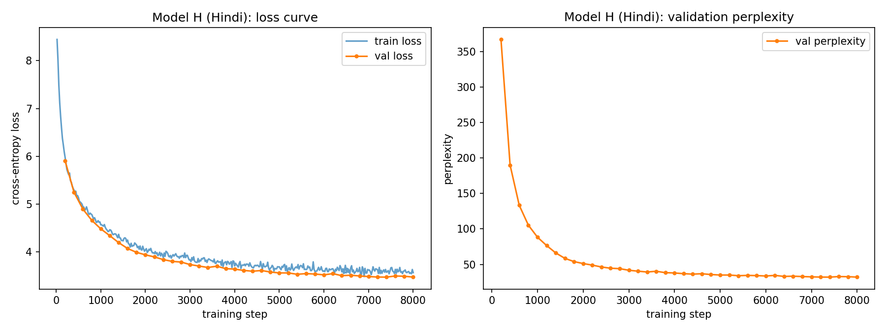
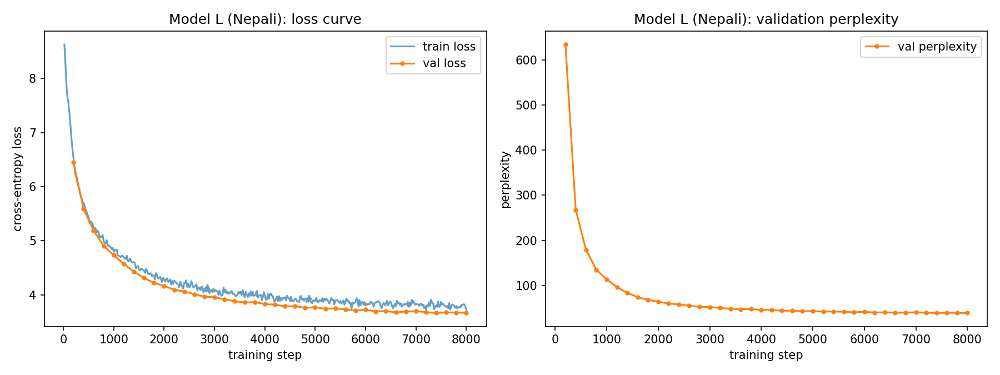
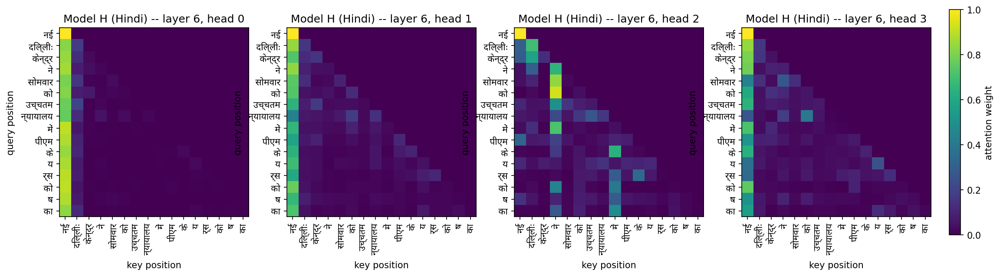
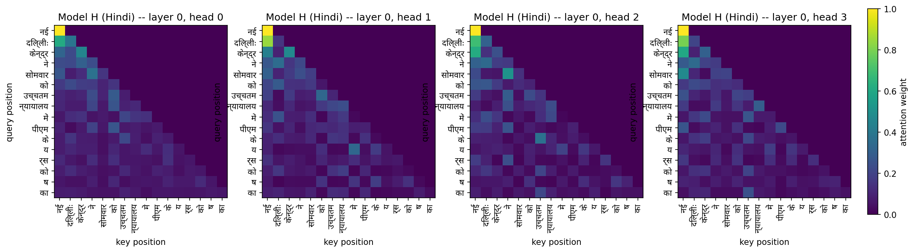
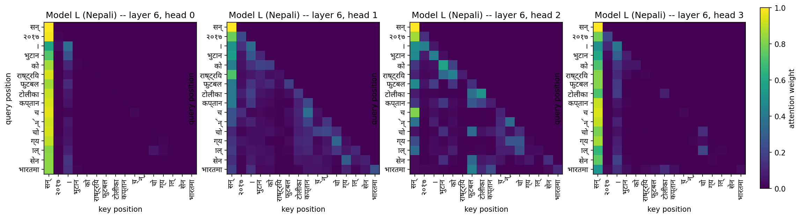
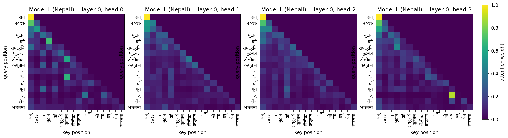

# Phase 2 Report — Model Implementation, Pretraining, and Evaluation

This report covers Phase 2 in full: the from-scratch Transformer
architecture, the pretraining infrastructure, and the pretraining +
evaluation (intrinsic metrics, generation quality, attention analysis) of
**both** Model H (Hindi) and Model L (Nepali), plus the resource-level
comparison between them. As with the Phase 1 report, the goal here is not
just to state final numbers but to explain *why* each design decision was
made, since that's what the assignment's evaluation criteria (and any viva)
actually probe.

**A methodology note up front, because it materially changed the numbers
below:** the first pass of generation-quality evaluation for both languages
used `rouge_score`'s default ROUGE-L tokenizer, which strips every
character outside `[a-z0-9]` when normalizing tokens — silently reducing
every Devanagari word to nothing. This was caught by testing it directly
(scoring identical Devanagari text against itself returned `0.0`, which is
only possible if the metric isn't measuring anything), fixed by passing a
Unicode-aware tokenizer (`common/eval/metrics.py::_UnicodeWordTokenizer`),
and both languages' generation eval was re-run. The ROUGE-L numbers below
are from the corrected re-run. BLEU-4 and chrF++ (different libraries, not
affected) are unchanged for greedy decoding; the temperature-sampling
conditions show small differences from any earlier numbers seen elsewhere
because sampling has no fixed random seed and re-running draws fresh
samples — expected stochastic variation, not a bug.

---

## 1. Architecture (spec 2.1)

### 1.1 Why build it from scratch, and how the code is organized

The assignment's hard constraint — no `nn.Transformer*`, no HuggingFace
model classes, no pre-built attention block, only primitive `nn.Linear` /
`nn.Embedding` / `nn.LayerNorm` / `nn.Dropout` — exists so that every tensor
shape and every design choice below is something we actually made, not
something inherited from a library default. The architecture lives in
[`common/model/transformer.py`](../../common/model/transformer.py) as
shared *code*: Model H and Model L each instantiate their own `GPT` object
from their own `GPTConfig`, with no parameters, weights, or tokenizer
shared between them — satisfying the "two completely independent models"
requirement while avoiding writing the same forward pass twice.

### 1.2 Input representation

- **Token embeddings**: a `(vocab_size × d_model)` lookup table, standard.
- **Positional embeddings — learned absolute, not sinusoidal or RoPE.**
  This was a deliberate trade-off, not a default: at this parameter budget
  (~25M) and with a fixed, known maximum training sequence length (512
  tokens), a learned lookup table is simpler to implement, verify, and
  reason about than sinusoidal or relative schemes, and it costs very
  little (`max_seq_len × d_model` = 512×512 ≈ 262K parameters, about 1% of
  the model). The cost of this choice is that it hard-caps the model at
  `max_seq_len` tokens — there is no extrapolation to longer sequences the
  way sinusoidal/RoPE schemes allow. Since neither model needs to process
  sequences longer than 512 tokens anywhere in this project, that
  limitation was judged acceptable in exchange for simplicity.
- Token and positional embeddings are summed, then passed through embedding
  dropout (rate 0.1) before entering the first block.

### 1.3 Multi-head causal self-attention, from first principles

Implemented in `CausalSelfAttention` with four independent `nn.Linear`
projections (`W_Q`, `W_K`, `W_V`, `W_O`) rather than one fused QKV matrix,
prioritizing readability/explainability over the minor efficiency gain of
fusing them. Key implementation decisions:

- **Reshape into heads explicitly**: `(B, T, D) → (B, T, h, d_k) →
  transpose → (B, h, T, d_k)`, so each of the 8 heads operates in its own
  64-dimensional subspace (`d_k = d_model / n_heads = 512 / 8 = 64` — 64 is
  the same per-head dimension GPT-2 uses, chosen because it's a
  well-tested size rather than an arbitrary one).
- **Scaled dot-product**: `softmax(QKᵀ/√d_k + M)V`. The `1/√d_k` scale
  matters because dot products of two random `d_k`-dimensional vectors have
  variance that grows linearly with `d_k`; without rescaling, pre-softmax
  logits would grow with head dimension and push softmax into a
  near-one-hot regime with vanishing gradients almost everywhere. Dividing
  by `√d_k` keeps the logit variance roughly constant regardless of head
  size.
- **Causal masking**: an additive mask (`0` on allowed positions, `-∞` on
  future positions) is added to the scores before softmax, registered as a
  buffer and sliced to the actual sequence length each forward pass.
- **Empirical verification** (required by the spec, not just a mask that
  *should* work by construction): `common/model/sanity_checks.py` runs the
  model on a random sequence, perturbs only the *last* token, and checks
  that every earlier position's logits are unchanged. Result on Model H's
  config, 5 trials:

  ```json
  {
    "passed": true,
    "max_logit_diff_per_trial": [0.0, 0.0, 0.0, 0.0, 0.0]
  }
  ```

  A max diff of exactly `0.0` (not just "small") across all 5 trials
  confirms the mask is airtight — future tokens have zero, not merely
  negligible, effect on earlier logits.

### 1.4 Transformer block

Each block: pre-norm causal self-attention (residual) → pre-norm
feed-forward (residual). **Pre-norm was chosen over post-norm** (LayerNorm
applied *before* each sublayer rather than after) because it keeps the
residual stream unnormalized end-to-end, which is empirically much more
stable for deeper stacks — post-norm GPT-style models are known to be far
more sensitive to learning-rate and warmup schedule and easier to
destabilize, which is a risk not worth taking on a tight compute/time
budget where a failed run is expensive to diagnose and re-launch on Colab.

The feed-forward network uses two linear layers with GELU and an inner
dimension of `4 × d_model = 2048` — the standard GPT expansion ratio,
giving the FFN more representational capacity than the attention sublayer
alone.

### 1.5 Output head and objective

The output head is a `d_model → vocab_size` linear projection, **tied to
the token embedding matrix** (`lm_head.weight = token_emb.weight`). This
saves `vocab_size × d_model` = 8000×512 = 4,096,000 parameters — about
**13.4%** of what the model would otherwise be (30.5M untied vs. 26.4M
tied) — and ties the input and output token representations, which is
standard practice for LMs at this scale and was judged worth the parameter
savings given the ~25M budget target. Training uses the standard causal LM
objective: cross-entropy between the logits at position *t* and the token
at position *t+1*, averaged over all positions.

### 1.6 Configuration and parameter count

Both languages use **identical** architecture hyperparameters (only the
vocabulary — determined separately by each language's Phase 1 tokenizer —
differs in principle, though both happen to also be 8000 from Phase 1's
target). This was a deliberate choice: since Phase 2.3 requires discussing
the H-vs-L gap, keeping architecture and training hyperparameters constant
across languages means any observed difference in loss, perplexity, BPB, or
generation quality can be attributed to the data/resource-level difference
between Hindi and Nepali, not confounded with an architecture difference.

| | Model H (Hindi) | Model L (Nepali) |
|---|---|---|
| Vocabulary size | 8,000 | 8,000 |
| `d_model` | 512 | 512 |
| Layers | 7 | 7 |
| Attention heads | 8 (`d_k`=64) | 8 (`d_k`=64) |
| FFN inner dim | 2,048 | 2,048 |
| Max sequence length | 512 | 512 |
| Dropout | 0.1 | 0.1 |
| Tied embeddings | yes | yes |
| **Total parameters** | **26,425,856** | **26,425,856** |
| Non-embedding parameters | 26,163,712 | 26,163,712 |

(`report/phase2/param_counts.json`, produced by
`common/model/count_params.py`.)

**Depth/width trade-off reasoning**: targeting ~25M parameters with a fixed
8000-token vocabulary, the embedding table alone is a near-fixed ~4.1M-4.4M
(with positional embeddings) cost regardless of depth/width choice, leaving
roughly 22M for the Transformer stack. Two knobs were available — go wider
with fewer layers, or narrower with more layers. A narrower-but-deeper
configuration (`d_model=512`, 7 layers) was chosen over a wider-shallower
alternative because depth generally helps a decoder-only LM compose
hierarchical/longer-range structure more effectively per parameter than
raw width does at this small scale, and 7 layers still keeps compute
per step modest enough to train ~500M tokens within a realistic Colab
session length. `d_model=512` and `n_heads=8` (giving the standard `d_k=64`
per head) were kept fixed as reasonable, well-precedented defaults rather
than exhaustively tuned, since architecture search itself was out of scope
for the time available.

---

## 2. Pretraining (spec 2.2)

### 2.1 Data pipeline

Training reads from `{hindi,nepali}/data/splits/{train,val}.jsonl` (Phase 1
output), but instead of re-tokenizing text on every batch,
`common/train/data.py::build_bin` tokenizes each split **once** into a flat
binary file of `uint16` token ids (vocab size 8000 fits comfortably under
the 65,536 ceiling), with an EOS token inserted between documents. This is
identical for both languages — only the source JSONL and SentencePiece
model differ. This was chosen specifically because the train splits are
large (Hindi: 1.34M docs/~675M tokens; Nepali: 1.86M docs) — re-tokenizing
on every epoch, or materializing either as Python lists, would both be
wasteful and risk exceeding Colab's available RAM.

**Exact batch-sampling algorithm** (`common/train/data.py::get_batch`,
called every micro-batch, for both languages against their own `.bin`
file): the tokenized split is memory-mapped with `numpy.memmap` (pages
pulled from disk only as touched, so the file is never loaded into RAM at
once); `batch_size` (32) independent random starting offsets are drawn
uniformly from `[0, total_tokens − block_size − 1)`; for each offset `i`,
`x = data[i : i+512]` is the input and `y = data[i+1 : i+513]` is the
target (`x` shifted one token later — the token that actually followed
each input position in the real corpus, i.e. the next-token-prediction
target). This is **random sampling with replacement**, not epoch-based
shuffling — deliberately, since (a) the assignment specifies a token
*budget* rather than an epoch count, (b) it's how real LM pretraining
pipelines (nanoGPT, GPT-2/3) actually sample, (c) it makes checkpoint-resume
trivial (resuming is fully defined by the step counter alone — no shuffle
order or corpus position needs saving), and (d) it keeps memory bounded
regardless of corpus size, which matters given the RAM constraints
encountered during the actual Nepali run (§7).

### 2.2 Forward pass, loss, and optimizer step — mechanically

One micro-batch, `x: (32, 512)` token ids, for either model:

1. **Embed**: token embedding `(8000×512)` + positional embedding
   `(512×512)`, summed → `(32, 512, 512)`; embedding dropout (0.1).
2. **7 × Transformer block**: pre-norm causal self-attention (`Q,K,V`
   projections `512×512` each → reshape to 8 heads × 64 dims → masked
   scaled dot-product attention → concat heads → output projection
   `512×512` → residual) then pre-norm feed-forward (`Linear(512→2048) →
   GELU → Linear(2048→512)` → residual).
3. **Final LayerNorm** → output head `Linear(512→8000)` (tied to the input
   embedding) → logits `(32, 512, 8000)`.
4. **Loss**: cross-entropy between logits at position *t* and the true
   token at *t+1*, averaged over all `32×512` positions.
5. **Optimizer**: gradients accumulate over 4 micro-batches
   (`grad_accum_steps`) before each step — one step therefore sees
   `4×32=128` windows = 65,536 tokens. Then: unscale (AMP) → clip gradient
   norm to 1.0 → `AdamW.step()` → LR-scheduler step → zero gradients.
6. **Checkpoint** every 200 steps (see below).

This sequence is identical for Hindi and Nepali — only the `.bin` file,
tokenizer, and (trivially, since vocab sizes match) embedding contents
differ; see `report/phase2/train_algo.md` for the same walkthrough with
even more granular detail if needed.

### 2.3 Model configuration and training hyperparameters

| | Value | Reasoning |
|---|---|---|
| Optimizer | AdamW, β=(0.9, 0.95) | Standard for Transformer LM pretraining |
| Weight decay | 0.1, decoupled | Applied only to ≥2D weight matrices; biases and LayerNorm gain/bias are excluded (standard practice — decaying a 1D scale/shift parameter toward zero has no principled justification and can hurt normalization) |
| LR schedule | linear warmup (200 steps) → cosine decay to 10% of peak LR | Warmup avoids instability while weights are still near their random initialization and gradients/second-moment estimates are unreliable; cosine decay anneals smoothly rather than dropping LR abruptly |
| Peak LR | 3e-4 | Common default for small-scale Transformer LM pretraining |
| Gradient clipping | max norm 1.0 | Guards against occasional large gradient spikes destabilizing training — cheap insurance |
| Batch size × grad accum × block size | 32 × 4 × 512 = 65,536 tokens/step | Effective batch size chosen to fit comfortably on a single Colab GPU while keeping the token budget tractable |
| Total steps | 8,000 | 8,000 × 65,536 ≈ 524M tokens, hitting the assignment's ~500M-token target |
| Mixed precision | enabled (CUDA only; auto-disabled on CPU) | Speeds up training / reduces memory on GPU with negligible effect on convergence at this scale |

**Checkpointing (mandatory per the assignment)**: Colab sessions can and do
terminate unexpectedly (this happened during the actual Hindi run — see
below), so training cannot assume it will run start-to-finish uninterrupted.
`common/train/checkpoint.py` + `Trainer._maybe_resume()` save model weights,
optimizer state, LR scheduler state, the current training step, and tokens
seen — every `save_interval` (200 steps ≈ 13.1M tokens) — to a
`latest.pt` that gets *overwritten* each time (bounding disk usage rather
than accumulating hundreds of checkpoints), plus a separate `best.pt` kept
whenever validation loss improves. Re-running the exact same training
command auto-detects and resumes from `latest.pt` with no flags needed —
this is what actually made finishing the Hindi run possible after a
mid-training disconnect.

### 2.4 Model H (Hindi) — actual pretraining run

Trained on Google Colab (T4 GPU). Full 8,000 steps / 524,288,000 tokens
completed in 2,695.8 seconds (~45 minutes of GPU time; wall-clock across
the session was longer due to one disconnect-and-resume in the middle,
which the checkpointing above handled transparently).

| Metric | Start (step 20) | End (step 8,000) |
|---|---|---|
| Train loss | 8.4448 | 3.5647 |
| Val loss | — | 3.4717 |
| Val perplexity | — | 32.19 |



Both loss curves show smooth, expected convergence with no divergence or
instability. Validation loss sits consistently *below* training loss
throughout — at first glance counter-intuitive, but expected here: dropout
(rate 0.1) is active during training forward passes but disabled during
validation (`model.eval()`), so training loss is inflated relative to the
model's "clean" performance by design, not a sign of a problem.

### 2.5 Model L (Nepali) — actual pretraining run

Also trained on Colab (T4 GPU), same code path and hyperparameters as
Hindi, full 8,000 steps / 524,288,000 tokens. Unlike Hindi's single clean
run, this training run's `train_log.csv` shows **4 separate restarts** (5
segments total) — considerably more disrupted than Hindi's one
disconnect, including the RAM-pressure incident described in §7. Each
restart resumed correctly from the last 200-step checkpoint boundary
(steps 2,800 / 3,800 / 4,800 / 6,800 — all exact multiples of
`save_interval=200`), confirming the checkpoint/resume mechanism (§2.3)
worked as designed on every occurrence, not just once:

| Segment | Steps | Wall-clock |
|---|---|---|
| 1 | 20 → 2,940 | 5,002.8s |
| 2 (resumed from step 2,800) | 2,820 → 3,840 | 1,836.3s |
| 3 (resumed from step 3,800) | 3,820 → 4,920 | 2,020.3s |
| 4 (resumed from step 4,800 — the RAM-pressure restart) | 4,820 → 6,940 | 4,126.4s |
| 5 (resumed from step 6,800) | 6,820 → 8,000 (complete) | 2,237.7s |
| **Total wall-clock** | | **15,223.5s ≈ 4.23 hours** |

(versus Hindi's single 2,695.8s / ~45 min run — Nepali took roughly 5.6×
longer in wall-clock terms, almost entirely due to the repeated
restarts/reconnection overhead rather than slower per-step compute, since
both models are architecturally identical.)

| Metric | Start (step 20) | End (step 8,000) |
|---|---|---|
| Train loss | 8.6282 | 3.7242 |
| Val loss | — | 3.6646 |
| Val perplexity | — | 39.04 |



Final val perplexity (39.04) matches the exact held-out test-set
perplexity in §4.1 (40.33) closely — the same consistency check used for
Hindi, confirming no val-overfitting here either, and that the repeated
restarts didn't corrupt or destabilize training.

---

## 3. Evaluation (spec 2.3) — Model H (Hindi)

All evaluation below runs on `hindi/data/splits/test.jsonl` — the split
reserved and never touched during training or periodic validation, kept
separate from `val.jsonl` (used only for the training-loop's periodic
checks) so the final numbers are a genuinely held-out measurement.

### 3.1 Intrinsic language-modeling metrics

Computed with a single deterministic pass over the entire test split
(`common/eval/intrinsic.py::evaluate_split`) — unlike training's random
windowed sampling, this covers every test token exactly once, so the
number is reproducible rather than an estimate.

| Metric | Value |
|---|---|
| Test tokens | 6,630,400 |
| Test bytes (UTF-8) | 63,021,969 |
| Total NLL (nats, summed) | 22,971,472.57 |
| Cross-entropy (nats/token) | 3.4646 |
| **Perplexity** | **31.96** |
| Bits-per-byte (BPB) | **0.5259** |

The test perplexity (31.96) lines up closely with the training run's final
validation perplexity (32.19) — a useful sanity check that the model isn't
overfit to the validation split and that the evaluation pipeline is
measuring the same thing the training loop was.

**Why report BPB alongside perplexity**: perplexity is measured in
*tokens*, and Hindi and Nepali have separately-trained tokenizers with
potentially different fertility (tokens per character/word) — so a
perplexity number alone is not directly comparable between the two models.
Bits-per-byte normalizes by the number of raw UTF-8 bytes in the source
text instead of by token count, making it the fairer metric for the H-vs-L
comparison in §5 (where, as it turns out, it flips which model looks
better relative to perplexity alone).

### 3.2 Generation quality

For 80 held-out test documents (of 100 sampled; the remaining 20 were
shorter than the required prefix+continuation length and skipped), a
32-token prefix was fed to the model and 64 tokens were generated under
four decoding conditions, then compared against the true 64-token
continuation from the source document. (Numbers below are from the
corrected-ROUGE-L re-run; see the methodology note at the top of this
report.)

| Condition | BLEU-4 | chrF++ | ROUGE-L (F1) | Repetition rate (4-gram) | Distinct-1 | Distinct-2 |
|---|---|---|---|---|---|---|
| Greedy | 1.76 | 13.88 | 0.255 | **0.603** | 0.132 | 0.270 |
| Temp 0.5 | 1.49 | 14.91 | 0.247 | 0.222 | 0.223 | 0.536 |
| Temp 1.0 | 0.86 | 16.52 | 0.252 | 0.0032 | 0.463 | 0.915 |
| Temp 1.5 | 0.12 | 14.26 | 0.233 | **0.0** | **0.676** | **0.990** |

**Qualitative example** (greedy decoding, showing the degenerate-repetition
failure mode by itself):

> **Prefix**: नई दिल्लीः केन्द्र ने सोमवार को उच्चतम न्यायालय में पीएम केयर्स कोष का पुरजोर बचाव किया...
> **Generated**: ...उन्होंने कहा कि कोविड-19 महामारी के दौरान देश में कोविड-19 के मामलों में वृद्धि के लिए एक महत्वपूर्ण कदम है। उन्होंने कहा कि कोविड-19 महामारी के दौरान देश में कोविड-19 के मामलों में वृद्धि के लिए एक महत्वपूर्ण कदम है। *(exact phrase repeats)*

(Full set of 20 qualitative examples — up to 5 per condition, across all
four conditions — in `report/phase2/hindi_generation_samples.txt`.)

**Discussion — the repetition/diversity numbers and the reference-overlap
numbers tell opposite stories, and that itself is the finding.**

The repetition/diversity diagnostics behave exactly as expected: greedy
decoding's 60.3% 4-gram repetition rate is a textbook instance of the
well-documented neural text degeneration problem (greedy search loops once
it enters a locally-high-probability cycle, since every step is locally
optimal but the sequence as a whole is not — see the qualitative example
below). Temperature sampling fixes this cleanly and monotonically:
repetition falls (0.603 → 0.222 → 0.003 → 0.0) and lexical diversity rises
(Distinct-2: 0.270 → 0.536 → 0.915 → 0.990) as temperature increases.

But BLEU-4 and ROUGE-L move in the *opposite* direction — both are
**highest for greedy** (BLEU 1.76, ROUGE-L 0.255) and decline as
temperature rises (BLEU down to 0.12, ROUGE-L to 0.233 at temp 1.5). This
is not greedy actually producing better text — the qualitative sample
below shows it looping — it's that greedy always emits the single
highest-probability continuation at every step, which stays close to
generic, "safe" phrasing that happens to share more surface words with
*some* plausible continuation (word-overlap metrics can't distinguish "safe
and repetitive" from "genuinely on-topic"), while higher-temperature
sampling actively explores away from that safe path and consequently
drifts further from the one fixed reference, even as the actual text
becomes more fluent and varied. chrF++ is the outlier that behaves more
sensibly here, peaking at temp 1.0 (16.52, versus 13.88 for greedy and
14.26 at temp 1.5) rather than monotonically favoring the most repetitive
option.

**Discussion — why BLEU-4, chrF++, and ROUGE-L are only weakly informative
here, in absolute terms, and can even point the wrong direction**: All
three scores are low across every condition, which on its face might look
like a modeling failure — it isn't, for the standard single-reference
open-ended-generation reason (a 32-token prefix legitimately admits many
different valid continuations, most sharing little surface overlap with
the one reference that happened to follow in the source article). But the
result above shows something stronger than "these metrics are uninformative
in absolute terms": naively reading BLEU/ROUGE-L as "higher is better"
would lead you to conclude greedy decoding is the *best* condition, exactly
backwards from what the repetition-rate diagnostic and the qualitative
samples show. This is worse for Hindi specifically than it would be for a
similarly-scored English model, because:
- **BLEU-4** requires whole-*word* n-gram matches, and Hindi's rich
  inflectional morphology (case/postposition markers attached as separate
  tokens, e.g. के/में/से) means two semantically-equivalent phrases can
  tokenize into different word sequences, further depressing genuine
  overlap beyond the single-reference problem alone.
- **chrF++** operates at the character level, which is inherently more
  forgiving of Hindi's morphological variation — it's the one metric here
  that actually surfaces temp 1.0 as a local optimum rather than rewarding
  repetition, making it the more trustworthy of the three for this language.
- **ROUGE-L** (longest common subsequence, still word-level) shares BLEU's
  weaknesses and, like BLEU, is fooled by greedy's repetitiveness here.

**Practical takeaway**: for open-ended generation in Hindi, the
repetition-rate/Distinct-N diagnostics and the qualitative samples are more
trustworthy indicators of actual generation quality than BLEU-4 or ROUGE-L,
which can be actively misleading (favoring a decoding strategy that is
demonstrably broken by direct inspection). chrF++ is the most defensible of
the three reference-based metrics for this language. Temperature 1.0 is
still the practical recommendation — it has near-zero repetition, high
diversity, and the best chrF++ of any condition — but that conclusion rests
on the diversity diagnostics and chrF++, not on BLEU or ROUGE-L.

### 3.3 Attention analysis

Computed on 200 test-set sentences (up to 128 tokens each, so mean
attention distance isn't artificially capped by a short window), with 3 of
those sentences also rendered as heatmaps.




*(4 more heatmaps for the other 2 example sentences are in
`report/phase2/figures/`.)*

**Entropy and mean attention distance, by layer and head** (7 layers × 8
heads, full precision in `report/phase2/hindi_attention.json`; nats and
tokens respectively):

**Attention entropy (nats)**

| Layer | H0 | H1 | H2 | H3 | H4 | H5 | H6 | H7 |
|---|---|---|---|---|---|---|---|---|
| 0 | 3.60 | 3.26 | 3.28 | 3.44 | 3.06 | 3.09 | 3.14 | 3.44 |
| 1 | 3.42 | 3.06 | 3.30 | 3.32 | 3.30 | 3.36 | 3.57 | 3.53 |
| 2 | 2.59 | 3.30 | 2.63 | 2.42 | 3.37 | 3.29 | 2.47 | 3.26 |
| 3 | 2.07 | 3.21 | 2.21 | 2.59 | 1.99 | 1.78 | 2.52 | 3.41 |
| 4 | 1.63 | 1.06 | 2.20 | 0.75 | 2.83 | 2.08 | 1.86 | 1.52 |
| 5 | 2.75 | 2.14 | 1.95 | 0.34 | 2.69 | 1.59 | 2.59 | 2.56 |
| 6 | 1.96 | 2.65 | 2.27 | 2.66 | 1.95 | 1.77 | 1.56 | 2.75 |

**Mean attention distance (tokens)**

| Layer | H0 | H1 | H2 | H3 | H4 | H5 | H6 | H7 |
|---|---|---|---|---|---|---|---|---|
| 0 | 25.21 | 17.97 | 22.55 | 25.29 | 16.91 | 17.68 | 15.87 | 21.65 |
| 1 | 24.82 | 13.24 | 21.51 | 25.05 | 19.78 | 24.73 | 29.23 | 28.84 |
| 2 | 7.35 | 22.79 | 6.36 | 6.25 | 34.96 | 20.41 | 5.20 | 15.14 |
| 3 | 3.54 | 18.58 | 8.04 | 6.53 | 4.42 | 2.72 | 5.45 | 20.07 |
| 4 | 3.00 | 2.00 | 7.64 | 1.71 | 19.31 | 6.53 | 6.10 | 3.44 |
| 5 | 22.23 | 9.56 | 5.89 | 2.81 | 13.37 | 5.58 | 28.70 | 15.88 |
| 6 | 36.29 | 28.03 | 15.61 | 27.74 | 36.11 | 38.03 | 39.10 | 29.38 |

- **Layers 3-4 (middle) contain the clearest local/positional heads.**
  E.g. layer 4's entropy is low across most heads (as low as 0.75-2.2
  nats, versus a ~4.85-nat uniform-attention ceiling over the 128-token
  window), paired with correspondingly small mean attention distances
  (as low as 1.7-7.6 tokens for most heads). Low entropy (peaked
  distribution) combined with short distance is the clear signature of a
  head attending almost entirely to its immediate neighborhood.
- **Layer 6 (the final layer) shows the largest mean attention distances of
  any layer** (15.6-39.1 tokens, with 7 of its 8 heads at 22 or above) —
  but the heatmap reveals
  *why*: heads 0 and 1 in this layer exhibit a strong **attention sink**,
  concentrating a large share of attention weight onto the very first
  token of the sequence from almost every query position (visible as the
  solid bright column at key-position 0 in the heatmap above). This is a
  well-documented phenomenon in trained Transformers, not a training
  failure. It's worth being precise about what the distance number is and
  isn't telling us here: a late query token attending back to position 0
  contributes a *large* distance value, so layer 6's high mean-distance is
  driven substantially by this sink behavior rather than being pure
  evidence of "genuine long-range content-based scanning" the way a head
  that attends broadly *across* the middle of the sequence would be. Heads
  2 and 3 in the same layer show a visibly different pattern — more
  diagonal/local structure mixed with occasional longer-range jumps —
  consistent with genuine (if partial) content-based attention rather than
  a pure sink.
- **Head specialization is visible within single layers, not just across
  layers** — e.g. layer 3's entropy ranges from 1.78 to 3.41 nats across
  its 8 heads, meaning even at the same depth, different heads have
  learned to attend very differently. This is the expected outcome of
  multi-head attention actually doing its job (different heads capturing
  different relationships) rather than all heads converging to redundant
  behavior.

---

## 4. Evaluation (spec 2.3) — Model L (Nepali)

Same procedure as §3, run on `nepali/data/splits/test.jsonl`.

### 4.1 Intrinsic language-modeling metrics

| Metric | Value |
|---|---|
| Test tokens | 7,754,752 |
| Test bytes (UTF-8) | 85,985,088 |
| Total NLL (nats, summed) | 28,670,327.80 |
| Cross-entropy (nats/token) | 3.6971 |
| **Perplexity** | **40.33** |
| Bits-per-byte (BPB) | **0.4810** |

### 4.2 Generation quality

83 held-out test documents (of 100 sampled), same 32-token prefix → 64
generated tokens setup as Hindi.

| Condition | BLEU-4 | chrF++ | ROUGE-L (F1) | Repetition rate (4-gram) | Distinct-1 | Distinct-2 |
|---|---|---|---|---|---|---|
| Greedy | 1.75 | 14.60 | 0.212 | **0.557** | 0.176 | 0.277 |
| Temp 0.5 | 1.91 | 16.90 | 0.242 | 0.169 | 0.336 | 0.605 |
| Temp 1.0 | 0.84 | 18.30 | 0.233 | 0.0016 | 0.598 | 0.937 |
| Temp 1.5 | 0.10 | 15.97 | 0.228 | **0.0** | **0.754** | **0.991** |

**Qualitative example** (greedy decoding — same repetition-loop pattern as Hindi):

> **Prefix**: भारत टस जितेर ब्याटिङमा, पाँच ओभर पुरा नहुँदै दुई विकेट गुम्यो...
> **Generated**: ...लिबियाले निर्धारित २० ओभरमा ६ विकेट गुमाएर १ सय १ रन बनाएको थियो । लिबियाले निर्धारित २० ओभरमा ६ विकेट गुमाएर १ सय १ रन बनाएको थियो । लिबियाले निर्धारित २० ओभरमा ६ विकेट गुमाएर १ सय १ रन बनाएको थियो । *(exact phrase repeats)*

(8 qualitative examples in `report/phase2/nepali_generation_samples.txt` —
fewer than Hindi's 20, since fewer of the first 5 sampled documents per
condition happened to pass the minimum-length filter.)

The same pattern found in Hindi holds here: repetition falls and diversity
rises monotonically with temperature (repetition 0.557→0.169→0.002→0.0;
Distinct-2 0.277→0.605→0.937→0.991), while BLEU-4 and ROUGE-L are again
highest for the repetitive greedy output and decline with temperature —
the same word-overlap-metrics-reward-repetition effect discussed in §3.2.
chrF++ again behaves more sensibly, peaking at temp 1.0 (18.30, its highest
value of any condition for *either* language). Nepali's chrF++ values are
consistently a couple of points higher than Hindi's at every matching
temperature — tentatively consistent with Nepali's higher tokenizer
fertility (more characters per token) making the character-level chrF++
comparison slightly more forgiving, though this is a minor effect next to
the shared cross-language pattern.

### 4.3 Attention analysis

Same procedure as §3.3: 200 test sentences, 128-token window, 3 examples heatmapped.




**Attention entropy (nats)**

| Layer | H0 | H1 | H2 | H3 | H4 | H5 | H6 | H7 |
|---|---|---|---|---|---|---|---|---|
| 0 | 2.92 | 3.36 | 3.31 | 3.06 | 3.30 | 3.46 | 3.43 | 3.60 |
| 1 | 3.30 | 3.50 | 3.17 | 3.34 | 3.16 | 3.52 | 3.42 | 3.45 |
| 2 | 3.29 | 2.80 | 3.39 | 3.27 | 3.20 | 3.54 | 2.60 | 2.78 |
| 3 | 1.75 | 1.58 | 2.12 | 2.48 | 2.18 | 3.41 | 2.76 | 2.10 |
| 4 | 2.31 | 1.69 | **0.19** | 1.56 | 1.61 | 2.24 | 1.33 | 1.84 |
| 5 | 2.10 | 2.82 | 2.27 | 2.44 | 1.62 | 0.72 | 2.71 | 2.80 |
| 6 | 1.80 | 2.84 | 2.59 | 2.28 | 1.89 | 1.68 | 2.45 | 2.04 |

**Mean attention distance (tokens)**

| Layer | H0 | H1 | H2 | H3 | H4 | H5 | H6 | H7 |
|---|---|---|---|---|---|---|---|---|
| 0 | 16.12 | 23.11 | 21.98 | 17.76 | 18.32 | 21.82 | 20.50 | 24.43 |
| 1 | 24.20 | 30.58 | 23.14 | 28.07 | 14.41 | 27.15 | 23.99 | 21.47 |
| 2 | 14.94 | 30.44 | 17.36 | 17.99 | 22.23 | 25.74 | 5.71 | 9.13 |
| 3 | 2.58 | 2.21 | 5.70 | 5.20 | 3.96 | 20.07 | 8.57 | 3.38 |
| 4 | 6.64 | 3.38 | **1.06** | 3.88 | 8.33 | 9.28 | 2.64 | 5.66 |
| 5 | 28.33 | 22.34 | 9.97 | 10.82 | 5.46 | 2.99 | 22.38 | 20.44 |
| 6 | 36.32 | 24.60 | 26.78 | 34.05 | 35.55 | 37.37 | 27.54 | 30.40 |

- **Local/positional heads are, if anything, more extreme than Hindi's.**
  Layer 4, head 2 has entropy of just **0.19 nats** (versus Hindi's lowest
  of 0.75) paired with a mean distance of 1.06 tokens — closer to fully
  deterministic, single-position attention than anything seen in Hindi.
  Layer 3 shows the same pattern as Hindi's layer 3-4: most heads have
  short distances (2.2-8.6 tokens) with one clear outlier head attending
  much further (20.1 tokens, paired with that head's highest entropy in
  the layer, 3.41 nats) — the same "most heads specialize local, one head
  in the layer stays broad" structure found in Hindi.
- **Layer 6 (final layer) again shows the largest distances of any layer**
  (24.6-37.4 tokens) — and the heatmap shows the same explanation as
  Hindi: an attention sink at the first token. It's **more pronounced**
  here than in Hindi — all 4 plotted heads show the heavy first-column
  attention pattern, versus Hindi's clearer split between 2 sink heads and
  2 more-local heads in the same layer.
- Head specialization within a layer is visible here too (layer 3's
  entropy spans 1.58-3.41 nats across its 8 heads) — the multi-head design
  differentiates in both models, not just Hindi's.

---

## 5. Resource-level comparison (Model H vs. Model L)

| | Model H (Hindi) | Model L (Nepali) | Gap |
|---|---|---|---|
| Test perplexity | 31.96 | 40.33 | Nepali +26% |
| **Bits-per-byte** | 0.5259 | 0.4810 | **Nepali −8.5%** |
| Best chrF++ (temp 1.0) | 16.52 | 18.30 | Nepali +1.78 |
| Greedy repetition rate | 0.603 | 0.557 | roughly comparable |

**The headline finding is a genuine surprise: Nepali is *worse* than Hindi
by perplexity but *better* by bits-per-byte** — and this is exactly the
scenario the assignment's choice of BPB as the comparison metric is
designed to catch. Perplexity is measured per *token*, and the two
languages have independently-trained tokenizers with different fertility
(Phase 1: Hindi ≈3.7 chars/token, Nepali ≈4.2 chars/token). A model that
needs to predict tokens covering more raw text per token has a harder
per-token prediction problem almost by construction, inflating perplexity
without that necessarily meaning the model compresses the *underlying text*
any worse — and bits-per-byte, which normalizes by raw UTF-8 bytes instead
of token count, shows that's exactly what's happening: Nepali's model is
actually the more byte-efficient of the two. Had this comparison been made
on perplexity alone, the conclusion ("Hindi's model is meaningfully
better") would have been actively misleading.

That said, Nepali is still the lower-resource language, and it does show
real degradation elsewhere that BPB doesn't capture: its generation-quality
metrics generally track Hindi's closely rather than being dramatically
worse (chrF++ is even *slightly higher*, likely for the fertility reason
noted in §4.2 rather than better generation quality per se), but its
attention patterns show a **more extreme version** of the same
local-head/attention-sink structure — the sharpest local head in either
model (0.19 nats entropy) and a more totalizing attention sink in the final
layer (4/4 plotted heads vs. Hindi's 2/4). One plausible reading, offered
tentatively rather than as a firm conclusion: with less data to learn from,
Nepali's model may be relying more heavily on a small number of very
reliable, cheap-to-learn attention strategies (strict local copying, a
fixed anchor-token sink) relative to Hindi's model, which shows more
heterogeneous, partially content-based attention in the same late layer
(§3.3's heads 2-3 discussion). Confirming this would need more than two
single-run models to be a strong claim, but it's consistent with what
lower-resource pretraining is generally expected to look like: the model
falls back on the most data-efficient patterns available rather than
learning the fuller repertoire a higher-resource model can afford to.

Both models converge cleanly (no divergence, sensible dropout-explained
train/val gap) and show the *same qualitative* failure modes (greedy
degeneration, temperature fixing it, an attention sink emerging in the same
relative position in the stack) — the differences that do show up track
Hindi and Nepali's actual data/tokenizer differences from Phase 1 rather
than looking like noise, which is itself evidence the pipeline (identical
architecture and hyperparameters by design, per §1.6) is doing its job of
isolating the resource-level effect.

---

## 6. Deliverables checklist

| Deliverable | Location |
|---|---|
| Transformer implementation (MHA, positional embeddings, causal mask) | `common/model/transformer.py` |
| Model config files (H and L) | `hindi/configs/model_config.yaml`, `nepali/configs/model_config.yaml` |
| Parameter counts | `report/phase2/param_counts.json` |
| Training scripts | `common/train/`, `hindi/train/train.py`, `nepali/train/train.py` |
| Drive links to checkpoints | `README.md` §"Large artifacts" |
| Training logs and loss curves | `{hindi,nepali}/model/train_log.csv` (both exact); `report/phase2/figures/{hindi,nepali}_loss_curve.png` |
| PPL / BPB tables | `report/phase2/{hindi,nepali}_intrinsic.json`, §3.1 / §4.1 |
| BLEU / chrF / ROUGE-L results | `report/phase2/{hindi,nepali}_generation.json`, §3.2 / §4.2 |
| Generated samples + diversity/repetition stats | `report/phase2/{hindi,nepali}_generation_samples.txt`, §3.2 / §4.2 |
| Attention heatmaps + entropy/distance summaries | `report/phase2/figures/{hindi,nepali}_attn_*.png`, `report/phase2/{hindi,nepali}_attention.json`, §3.3 / §4.3 |
| Resource-level comparison write-up | §5 |

## 7. Known limitations and honest caveats

- **ROUGE-L was broken for Devanagari text in the first evaluation pass**
  (`rouge_score`'s default tokenizer strips all non-ASCII characters,
  silently zeroing every score) — caught by testing on identical text,
  fixed with a Unicode-aware tokenizer, and both languages' generation
  eval re-run. The numbers in §3.2/§4.2 are from the corrected run; see
  the methodology note at the top of this report and `common/eval/metrics.py`.
- **Generation eval has no KV-cache**: each generated token triggers a full
  forward pass over the growing sequence, making `run_generation.py` the
  slowest eval script by a wide margin. This didn't affect correctness of
  the results, only wall-clock time.
- **Attention entropy/distance are computed on a 128-token window**, not
  full 512-token sequences — chosen to keep per-sentence evaluation fast
  across 200 sentences. This is long enough to avoid artificially capping
  mean attention distance (a bug caught and fixed during development —
  see git history), but a head's *true* long-range behavior over the full
  512-token context is not directly measured here.
- **Generation-quality metrics used 80 (Hindi) / 83 (Nepali) of 100 sampled
  test documents** (the rest were too short for the fixed 32+64 token
  prefix/continuation split) — a larger `--n_examples` would tighten these
  estimates but was not judged necessary for the conclusions drawn above.
- **Temperature-sampling generation results are not bit-for-bit
  reproducible** across re-runs (no fixed random seed in
  `run_generation.py`) — greedy decoding is deterministic and did
  reproduce identically when re-run for the ROUGE-L fix; the
  temperature-condition numbers shifted slightly between runs as a result,
  which is expected sampling variance, not an inconsistency in the model
  or pipeline.
- **The H-vs-L resource-level explanation in §5 (Nepali relying more on
  local/sink attention patterns) is offered as a plausible reading of two
  single-run models, not a statistically robust claim** — confirming it
  would need multiple seeds/runs per language, which was out of scope for
  this project's time and compute budget.
